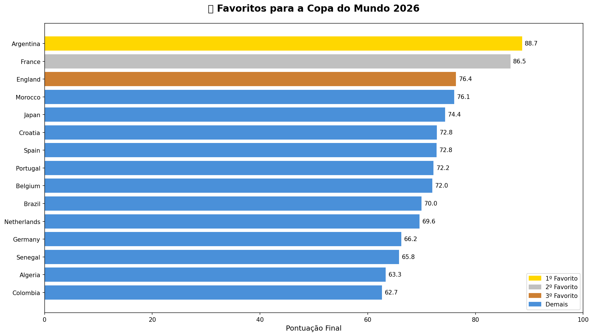
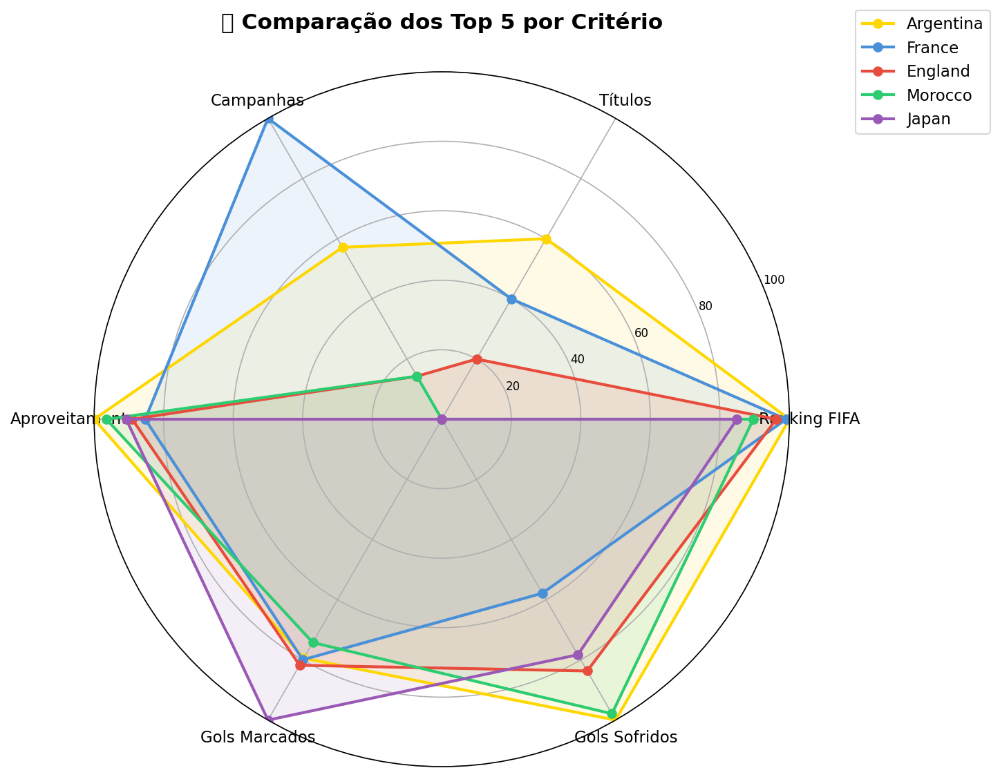
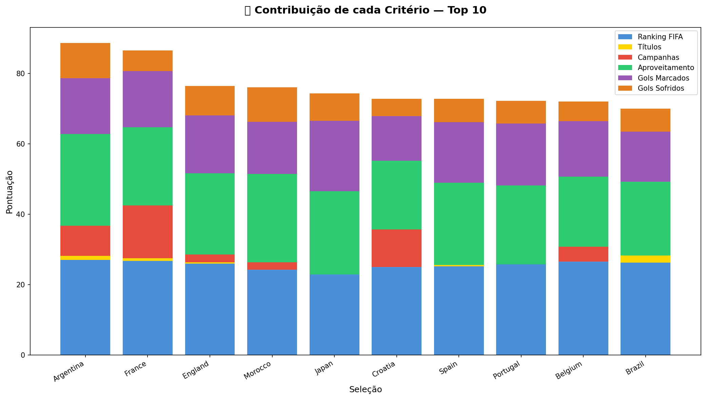

# Quem e o Favorito para Vencer a Copa do Mundo 2026?

Analise de dados para identificar os favoritos da Copa do Mundo 2026.

## Objetivo

Criar um ranking das 48 selecoes classificadas para a Copa 2026.

## Metodologia

| Criterio | Peso |
|---|---|
| Ranking FIFA | 28% |
| Aproveitamento recente (2021-2024) | 25% |
| Gols marcados por jogo | 20% |
| Campanhas recentes (2018 e 2022) | 15% |
| Gols sofridos por jogo | 10% |
| Titulos historicos | 2% |

## Top 10 Favoritos

| Posicao | Selecao | Pontuacao |
|---|---|---|
| 1 | Argentina | 88.7 |
| 2 | Franca | 86.6 |
| 3 | Inglaterra | 76.5 |
| 4 | Marrocos | 76.0 |
| 5 | Japao | 74.3 |
| 6 | Croatia | 73.0 |
| 7 | Espanha | 72.8 |
| 8 | Portugal | 72.3 |
| 9 | Belgica | 72.2 |
| 10 | Brasil | 70.2 |

## Visualizacoes

## Tecnologias

- Python 3
- Pandas
- NumPy
- Matplotlib
- Jupyter Notebook
- Git e GitHub

## Como Executar

1. git clone https://github.com/eduardohabbib/copa-2026-analise.git
2. pip install -r requirements.txt
3. jupyter notebook
4. Execute os notebooks na ordem: 01, 02, 03, 04

## Autor

Eduardo Habib
https://github.com/eduardohabbib
